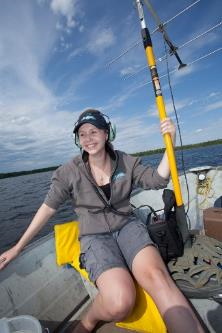
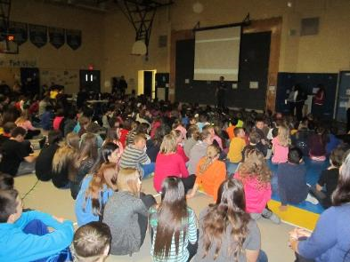
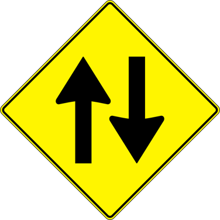
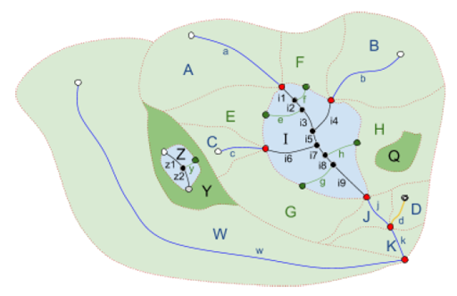

---
title:
author:
date:
output:
  revealjs::revealjs_presentation:
    css: style.css
    incremental: false
    theme: night
    highlight: tango
    transition: none
    center: true
---

# {data-background-color="#0a4f58"}

<h1>
Canadian Aquatic Barriers Database and Watershed Connectivity Planning
</h1>

<h4>
Nick Mazany-Wright
</h4>
<h4>
Canadian Wildlife Federation
</h4>
<h4>
October 21, 2021
</h4>

<div class="container">
<div class="col">
``` {r, echo=FALSE, out.width="50%", fig.align="left"}

knitr::include_graphics("./img/white-cwf-logo-en.svg")

#AWC3

```
</div>

<div class="col" style="justify-self: right;">
<span style="font-family: Impact;">AWC3 Fall 2021 Webinar Series</span>
</div>

</div>

# Canadian Wildlife Federation

## Who We Are

- One of Canada's largest environmental NGOs
- "To conserve and inspire the conservation of Canada's wildlife and habitats for the use and enjoyment for all"
- Freshwater, marine, and terrestrial programs
- Science, education, and advocacy

&nbsp;

<center>
{height=150px} {height=150px} {height=150px} {height=150px}
</center>

## National Fish Passage Program

Increased freshwater focus on connectivity and fish passage:

- Chinook salmon research in Upper Yukon River
- American eel research and advocacy
- Fish passage advocacy and barrier campaigns
- **<span style="color: #FFF263;">Development of the Canadian Aquatic Barriers Database</span>**
- **<span style="color: #FFF263;">Watershed Connectivity Remediation Planning framework</span>**

&nbsp;

<center>
{height=200px} {height=200px} {height=200px}
</center>

# Canadian Aquatic Barriers Database (CABD)

## Canadian Aquatic Barriers Database

<center>
**<span style="color: #FFF263;">Vision:</span>**
</center>

<center>
All Canada's barrier and connectivity information in one place -- no extra software required!
</center>

## CABD Background

- Inspired by TNC, NAACC, and NCC among other groups
- CABD = central pillar of tools to support CWF's fish passage program
- Uses and requirements extend beyond internal needs:
  + Freshwater connectivity research
  + Hydrological modelling
  + Infrastructure inventories

<center>
{height=250px}
</center>

## Stakeholder Engagement

- User requirements interviews
  + What type of work could the CABD support?
  + What are the key barrier types that should be included?
  + What information about individual barriers should be available?
  + How would users like to access the data?
- Working Group and Technical Advisory Committee
- **<span style="color: #FFF263;">Reciprocal</span>** data-sharing relationships

&nbsp;

<center>
{height=200px} {height=200px}
</center>

## Use Types

1. Regulation, policy, and reporting
2. Restoration planning and prioritization
3. Infrastructure asset management
4. Research and monitoring
5. Education and public outreach

## CABD Components

<div class="container">
<div class="col">
1. Analysis-ready hydrographic networks

{height=150px}
</div>

<div class="col">
2. Barrier data w/ standardized attributes

{height=150px}
</div>

<div class="col">
3. Web mapping interface and analytic tools

{height=150px}
</div>

</div>

## CABD Overview
- Open-source, standardized, central repository for small **<span style="color: #FFF263;">and</span>** large barriers
- Meet growing data requirements for connectivity research, barrier prioritization, and fish passage remediation across sectors
- Support Canada-wide collaboration on freshwater connectivity issues and share resources and information

## CABD v1.0

- Manage data volume during developing and testing
- Initial release:
  + Dams (all sizes)
  + Waterfalls
  + Fishways (CANFISHPASS)
  + Hydrographic network
- Will add additional barrier types in future years (e.g., **<span style="color: #FFF263;">stream crossings</span>**)

## Development Methods

- Develop hydro data processing tools &rarr; network analysis
- **<span style="color: #FFF263;">Phase 1:</span>** Compile and standardize existing datasets
- **<span style="color: #FFF263;">Phase 2:</span>** Identify and develop mechanisms to fill data gaps
  + Attributes
  + Barrier types
  + Geographic coverage
- Develop other tools
  + Standardized barrier assessment protocols
  + Citizen science app for barrier ID and assessment
  + Research collaborations

## Barrier Data Processing

- Manual review:
  + Complile existing and acquirable datasets
  + Verify geolocation using imagery
  + Remove duplicates between and within datasets
  + Map attributes from multiple sources and searches
  
## Hydro Data Processing

- Continue development of Common Hydrology Features (CHyF) tools and services
  + Open-source tools developed by NRCan
  + Flowpath and catchment tools
- Enforces topological relationships, flow directions, primary/secondary flowpaths
- Populate attributes (e.g., stream order)
- Will support web services to allow network analysis through web interface

<center>
{height=200px}
</center>

## Progress to Date

- Processed and standardized attributes for dam, waterfall, and fishway data
- Updates to CHyF processing tools
- CABD population with existing data types

## Barrier Types

{height=300px} {height=300px} {height=300} 

<span style = "font-size: 150%; padding-left: 65px;">30,000+</span> <span style = "font-size: 150%; padding-left: 140px;">10,000+</span> <span style = "font-size: 150%; padding-left:170px;">400+</span>

## Public Launch

- "Sneak peek" launch for eight pilot regions (**<span style="color: #FFF263;">early November</span>**)
  + Dams, waterfalls, fishways, and hydro networks
  + Explore attributes
  + View data sources
  + Download barrier data in .csv format
- Release remaining data province-by-province - summer 2022

## Demo!

<center>
<a href="https://aquaticbarriers.ca" data-preview-link>Canadian Aquatic Barriers Database</a>
</center>

## Next steps

Short-term:

- Begin to fill data gaps &rarr; many attributes empty
  + This includes input from practitioners and the public!
- Add data filter and download functionality
- Research partnerships to develop remote sensing/modelling tools to:
  + Identify barriers
  + Estimate passability

## <span style="color: Black;">Filter and download functionality</span> {data-background="./img/option_download_button_in_filters.png" color="black"}


<div class="left">

&nbsp;

</div>

<div class="right">
<span style="color: Black; padding-left: 50px; display: block">
Filter on a defined set of attributes
</span>

<span style="color: Black; padding-left: 50px; display: block">
Download hydro data and additional formats: Shapefile, Geopackage, KML
</span>


&nbsp;

&nbsp;

&nbsp;

&nbsp;

</div>

## Next Steps

Short-term:

- Review and synthesis of barrier assessment protocols
  + Modular approach to standardize but maintain flexibility across country, e.g., [NAACC protocols](https://streamcontinuity.org/naacc/assessments)
  + Engage with existing protocol developers/users
  + Series of regional workshops in winter/spring 2022 to receive input on protocol development

## Next Steps

Short-term:

- CABD documentation to support users and applications:
  + Data dictionary
  + Tool tutorials
  + FAQs
  + API use
  + CHyF processing tools

## Next Steps

Long-term:

- Compile and release stream-crossing data (2022 an beyond)
  + Test in pilot regions then expand
- Develop analysis and reporting tools accessible through interface
- Freshwater connectivity toolbox:
  + Resources, best practices, success stories
- Develop or adapt citizen science mobile app
  + Identify and assess barriers

# Watershed Connectivity Remediation Planning Framework

## Overview

- Developed and piloted in 4 watersheds in B.C.
- Desired collaborative, strategic framework to plan barrier remediation
- Develop watershed-scale plans to improve freshwater connectivity for target species
    + Identify partners and roles
    + Focus geographic scope of the work
    + Quantify the current connectivity status of the watershed
    + Set goals for gains in connectivity
    + Prioritize barriers and associated costs required to meet goals
    + Action plan with assigned responsibilities, including additional conservation actions

## Watershed Connectivity Remediation Plans (WCRPs)

- Adapted from international Conservation Standards framework
- "Thematic" plan addressing explicit threat of **<span style="color: #FFF263;">physical, localized barriers </span>** that can be directly remediated
- Can used as a "module" in broader watershed-scale conservation or restoration plans
- Focus on priority barriers, account for context with other threats and diminishing returns
- Living documents, iteratively updated over time

## Engagement and Collaborative Planning

Engage local partners (across sectors) through planning workshops:

- Avoid hit-and-run conservation
- Develop grassroots ownership and buy-in for plan
- Ensure local context and priorities are captured
- Support local Indigenous capacity building

## Flexibility and Customizeability

- Build on existing local work and initiatives
  + e.g., great data/modelling work underway by AEP, ABMI, AWC3, Foothills Stream Crossing Partnership
- Integrate with other tools, not replace
- Incorporate Indigenous and local knowledge
- Can be customized to various:
  + Target species (and life histories)
  + Habitat mapping/modelling
  + Connectivity indicators
  + Barrier types (e.g., account for dams, rail-stream crossings)

## Quantify Connectivity Status

- <a href="https://www.hillcrestgeo.ca/projects/cwf_wcrp/" data-preview-link>Modelling</a> to define the current "connectivity status"
- Allows each barrier to be measured against all other barriers in a watershed context

## Quantify Connectivity Status

Define Key Ecological Attributes (KEAs) and Indicators:

``` {r, echo=FALSE, out.width="100%", fig.align="center"}

knitr::include_graphics("./img/KEA_2.png")

#AWC3

```

## Barrier Types

- Identify and rate barrier types
- Decision-support tool to focus action planning

``` {r, echo=FALSE, out.width="100%", fig.align="center"}

knitr::include_graphics("./img/barrier_types.png")

#AWC3

```

## Goal Setting

``` {r, echo=FALSE, out.width="100%", fig.align="center"}

knitr::include_graphics("./img/goals.png")

#AWC3

```

## Situation Analysis

- Brainstorming exercise to map out the effects, contributing factors, and potential actions

``` {r, echo=FALSE, out.width="100%", fig.align="center"}


#AWC3

```

## Strategies and Actions

<center>

</center>

## Barrier Prioritization

``` {r connectivity status, echo=FALSE, results='asis'}
library(knitr)
library(kableExtra)
status = read.csv("./tbl/connectivity_status.csv")
kable(
  status, "simple",
  col.names = c('Habitat Type','Accessible (km)','Total (km)','Current Status','Goal','Gain Required(km)')
)

```

## Barrier Prioritization

Hybrid prioritization approach &rarr; evaluate 'sets' of barriers together to maximize habitat gains

<center>
{height=400px}
</center>

## Barrier Prioritization

<center>
{height=600px}
</center>

## Cost Estimates

<center>

</center>

## Alberta Pilot Project

- Submitted proposal to CNFASAR in partnership with AEP
- Apply framework in Berland-Wildhay watershed
  + Focus on Athabasca Rainbow Trout and Bull Trout
- Check out the <a href="https://cwf-fcf.org/en/resources/research-papers/CWF-WCRP-Guide.pdf" data-preview-link>WCRP Guide Document</a> for more info

# Thank you!

<center>
<h2>Questions?</h2>
</center>
<center>
nickw@cwf-fcf.org
</center>

<center>
*The Canadian Aquatic Barriers Database is a multi-year project that is supported partially by financial contributions from Fisheries and Oceans Canada and the RBC Foundation.*
</center>
